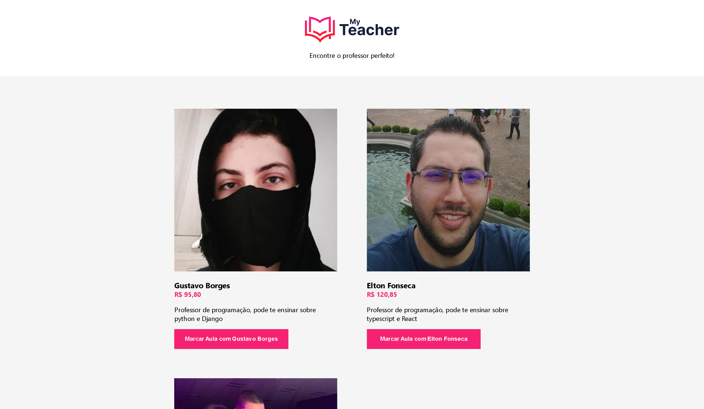

# My Teacher

  

## Índice
* [Introdução](#%EF%B8%8F-introdução)
* [Tecnologias utilizadas](#%EF%B8%8F-tecnologias-utilizadas)
* [Ferramentas utilizadas](#%EF%B8%8F-ferramentas-utilizadas)
* [Serviços utilizados](#-serviços-utilizados)
* [Funcionalidades do projeto](#-funcionalidades-do-projeto)
* [Acesso ao projeto](#-acesso-ao-projeto)
* [Autor](#-autor)
* [Contato](#%EF%B8%8F-contato)

## ⚙️ Introdução 

O projeto do my teacher é uma aplicação web funcional de agendamento de aulas, que busca e armazena dados dinamicamente do back-end e os exibe no front-end. O projeto foi desenvolvido durante o evento React Python da Treina Web e foi desenvolvido utilizando ferramentas React JS para o front-end e Django no back-end.

## 🖥️ Tecnologias utilizadas

- ``React JS``
- ``MUI Materials``
- ``Python``
- ``Django``

## 🛠️ Ferramentas utilizadas

- ``Visual Studio Code``
- ``Insomnia``

## 🧰 Serviços utilizados

- ``Github``

## 🪚 Funcionalidades do projeto

- ``Funcionalidade 1:`` Agendar aulas
- ``Funcionalidade 2:`` Buscar dinâmica em uma base de dados pelos professores cadastrados

## 📂 Acesso ao projeto

Você pode acessar o projeto [baixando-o](https://github.com/gustavotht21/my-teacher/archive/refs/heads/main.zip) e iniciando-o na IDE de sua preferência, onde quando executado irá abrir no navegador o projeto funcionando

## 👤 Autor

| [ Gustavo Casagrande Borges](https://github.com/gustavotht21) |  
| :---: | 

## ✉️ Contato

Entre em contato via e-mail: borges.gustavo@estudante.ifro.edu.br
